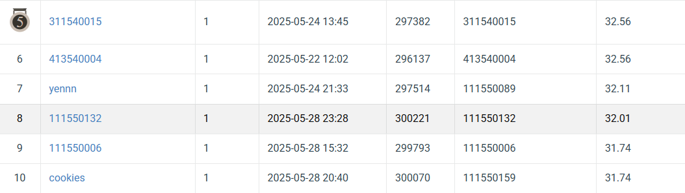

# NYCU VRDL 2025 Spring HW4

StudentID: 111550132

Name: 張家睿

## Introduction
This is an image restoration task. We need to use 3200 degraded images and 3200 corresponding clean images of rain and snow to train a PromptIR model to restore 100 degraded rain and snow images. Use PSNR to evaluate the performance of the output.

#### run:
* training PromptIR model: [code/train_PromptIR.py](code/train_PromptIR.py)
* training AdaIR model: [code/train_AdaIR.py](code/train_AdaIR.py)
* testing model: [code/demo.py](code/demo.py)

## How to install
Download the [env.yml](env.yml), execute this lines in a computer with conda.
```
conda env create -f env.yml -n env
# after creating env
conda activate env
python code/train.py
```

## Performance snapshot



**Acknowledgment:** This code is based on the [PromptIR](https://github.com/va1shn9v/PromptIR) repository. 